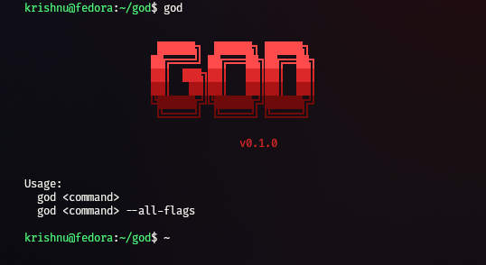
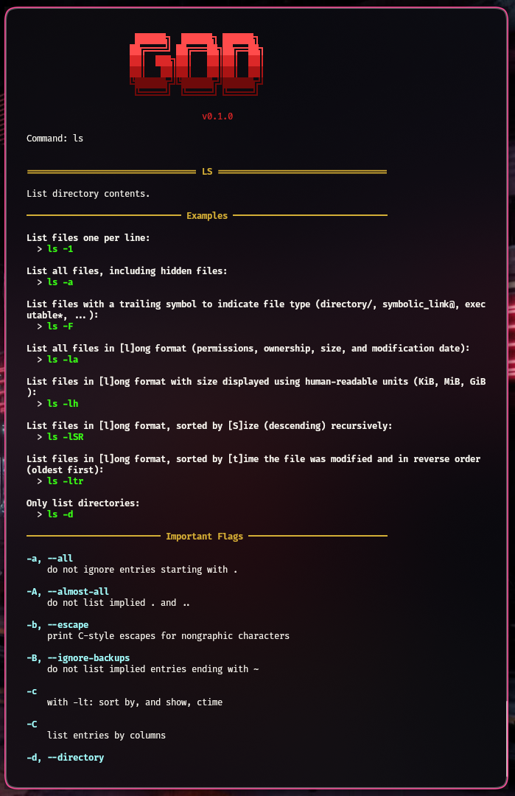
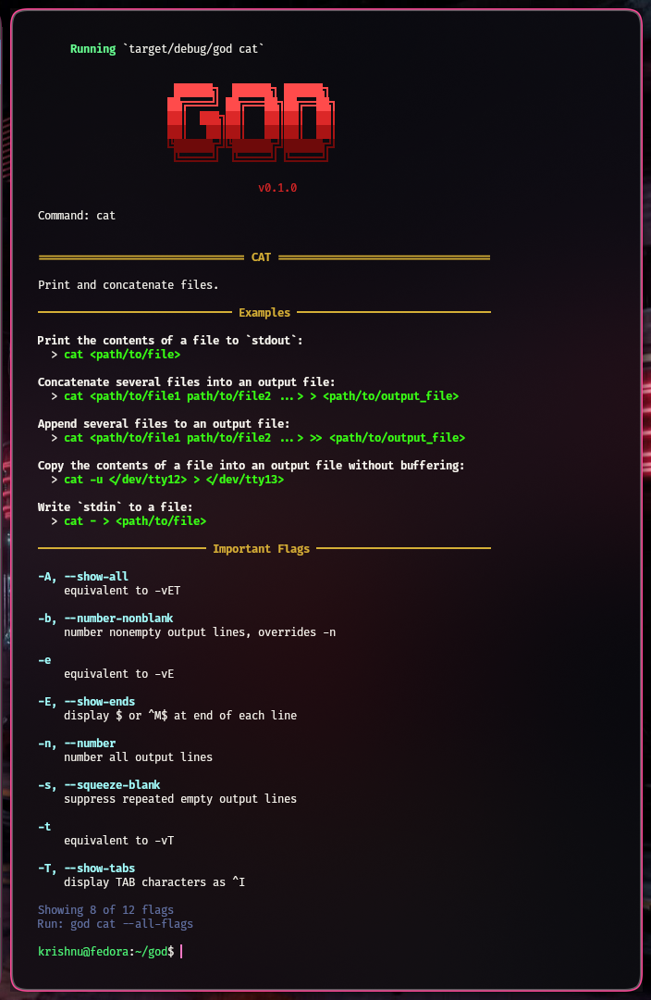

GOD

GOD is a command-line documentation tool for Linux.

It started as a small project because I found myself constantly switching between TLDR pages and man pages. TLDR is great when you just need a quick example, but it often leaves out useful information. Man pages contain everything, but they can be difficult to navigate for everyday use.

The goal of GOD is to combine both into a single interface that is easier to read while still providing the details when you need them.

Screenshots

- Startup

  

- Looking up the ls command

  

- Looking up the cat command

  

Installation

- Clone the repository.

      git clone https://github.com/MAAXRUDERZ/GOD.git

- Enter the project directory.

      cd GOD

- Install GOD.

      cargo install --path .

- If you make changes to the source code later, reinstall the updated version.

      cargo install --path . --force

Usage

- Show documentation for a command.

      god ls

- Show every available flag.

      god ls --all-flags

Current Features

- Combines TLDR pages with man pages.
- Presents the most commonly used flags by default.
- Shows the complete flag list with --all-flags.
- Clean terminal interface.
- Practical examples from TLDR pages.
- ANSI color output.
- Works completely offline.

Why?

I wanted a tool that was easier to read than man pages without losing the information that makes them useful. GOD is my attempt to bridge that gap by presenting the most useful information first while still making the complete documentation available when needed.

Roadmap

- Improve man page parsing.
- Better selection of important flags.
- Search documentation by keyword.
- Related command suggestions.
- Shell completion.

